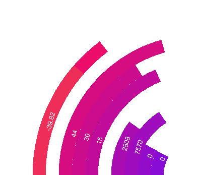

# ClockPlus

Desktop widget for displaying time as well as vital computer statistics
 

## Supported metrics
- Time (hour, minute, second)
- Date (month, day, day of week)
- Volume (percent, dB)
- Battery (percent, charging)
- CPU (clock speed, clock speed limit, percent)
- RAM (total, used, percent)
- Drive (read, write, percent)
- Network (send, receive)

(sample shown above, from outside to in: volume in dB, second, minute, hour, CPU, RAM, drive, network)

## Features
- Default two-tone colour scheme with optional colour override on any ring
- High refresh rate (>60Hz) for applicable metrics (e.g. live volume visualisation)
- Custom scaling independent of Windows DPI settings
- Ability to position at any point on screen and run rings from any start or ending angle, clockwise or anticlockwise
- Ring layering for alerts (e.g. flashing red upon RAM usage hitting >90%)

